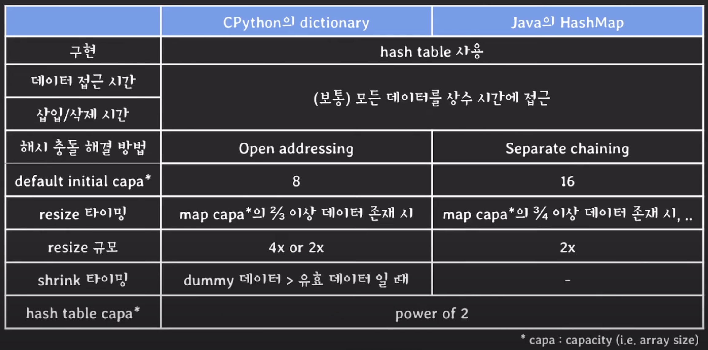

# python에서 모듈 = Counter
* 해쉬 함수는 python에서 dictionary로 구현되어 있다.

### Counter

* 참고로 Counter의 결과값은 딕셔너리이기 때문에 빠른 연산이 가능하다.

* 아래처럼 리스트 간의 연산 시에 for문과 remove를 하지 않아도 - 하나만으로 O(n)만에 끝낼 수 있다.

```
from collections import Counter

def solution(participant, completion):
    dict_result = Counter(participant) - Counter(completion)
    return list(dict_result.keys())[0]
```
<a href="https://school.programmers.co.kr/learn/courses/30/lessons/42576"> 참고자료(프로그래머스)</a>

### 왜 사용해?
1. 중복을 피하고 싶을 때 (set)
2. 빠른 검색

## 사용예제
```
phone_to_name = {}
phone_to_name['010-2222-3333'] = '이수빈'
phone_to_name['010-2242-3233'] = '홍길동'
print(phone_to_name.get('010-2222-3333')) # 이수빈
print('010-2111-1111' in phone_to_name) # False
```

# 개념
### 해쉬 table의 동작

<p align="center">
    
</p>

### 해쉬 충돌 방법
#### 충돌이란?
* key는 다른데 hash가 같을 때
* key도 hash도 다른데 hash % map_capa 결과가 같을 때

#### 1. open addressing
* 충돌 바로 지점 아래에 빈 공간이 있다면 새로운 값을 넣음

#### 2. Separate chaining
* 충돌 지점에 linked list를 만들어서 충돌 부분의 바로 다음 노드에 새로운 값을 넣음

# 출처
https://www.youtube.com/watch?v=ZBu_slSH5Sk
* 리마인드하고 싶으면 보기(꽤 괜찮은 영상임)