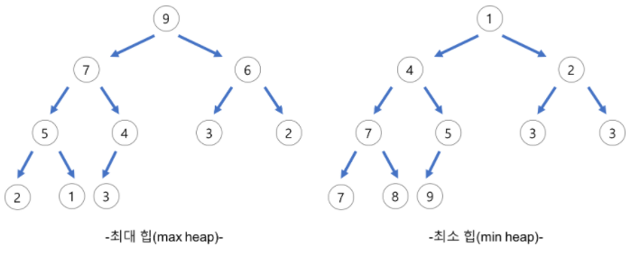
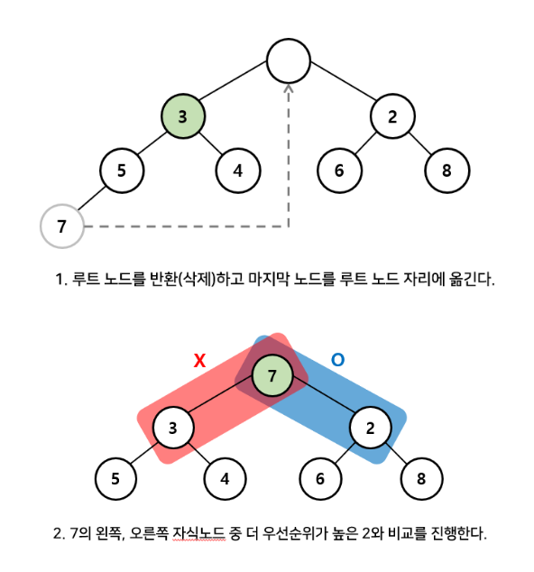

## Heap이란?
### 힙은 우선순위 큐를 위해 만들어진 자료구조다.

### 1. 우선순위 큐란?

* 큐 : FIFO 형식의 자료구조
* 우선순위 큐는 큐에 우선순위라는 개념을 접목시킨 자료구조이다.
* 따라서, 우선순위 큐는 먼저 들어오는 데이터가 아니라, 우선순위가 높은 데이터가 먼저 나가는 형태의 자료구조이다.

### 2. Heap
* 우선순위 큐를 위해 고안된 완전이진트리 형태의 자료구조
* 여러 값 중, 최대값과 최소값을 빠르게 찾아내도록 만들어진 자료구조
* 반정렬 상태를 유지 (ex. 부모 노드의 키 값이 자식 노드의 키 값보다 항상 큼 / 작음)
* 이진탐색트리(BST)와 달리 중복된 값이 허용된다.

## Heap 종류
### 1. 최대 힙 (max heap)
* 부모 노드의 키값이 자식 노드의 키 값보다 크거나 같은 완전 이진 트리
* key(부모 노드) >= key(자식 노드)
### 2. 최소 힙 (min heap)
* 부모 노드의 키 값이 자식 노드의 키 값보다 작거나 같은 완전 이진 트리
* key(부모 노드) <= key(자식 노드)

    

## 힙의 데이터 저장/삭제 개념
### 최소 힙에 저장할 때

1. 들어올 새 노드를 우선순위가 가장 낮다는 가정을 하고 맨 끝 위치에 저장
2. 부모 노드와 우선 순위를 비교해서 위치가 바뀌어야 하면 바꾼다.
3. 올바르게 위치할 때까지 B 반복

    

### 최소 힙에서 삭제할 때
* 우선순위 큐의 pop == 가장 우선순위가 높은 데이터를 빼낸다

1. 루트 노드를 반환(삭제)하고 마지막 노드(n)를 루트 노드 자리에 옮긴다.
2. n의 왼쪽, 오른쪽 자식노드 중 더 우선순위가 높은 것과 비료를 진행한다.
3. 최소 힙의 구조를 유지할 때까지 B 반복

    

위의 과정과 같이 힙의 구조를 유지하는 과정을 heapify라고 한다.